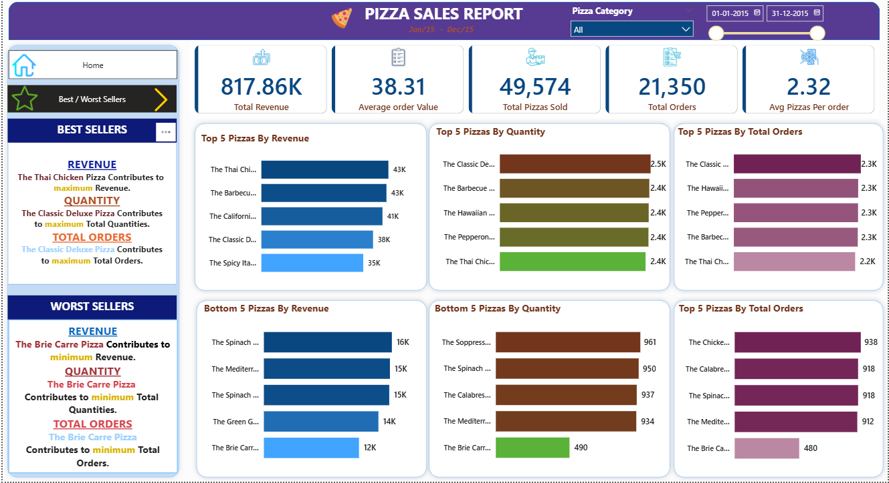

🍕 Pizza Sales Performance Analysis Dashboard

📌 Project Overview

This project analyzes pizza sales data to uncover key business insights such as revenue trends, customer ordering patterns, and product performance.
SQL was used to perform data analysis and calculate key metrics, while Microsoft Power BI was used to design an interactive dashboard for data visualization.
The objective of this project is to transform raw sales data into meaningful insights that support data-driven decision making.

🎯 Business Problem

A pizza restaurant wants to evaluate its sales performance to understand:

• Customer ordering patterns

• Best and worst selling pizzas

• Revenue contribution by pizza category and size

• Daily and weekly order trends

This analysis helps identify opportunities to improve product strategy and sales performance.

🛠 Tools & Technologies

• SQL – Data querying and KPI calculations

• Microsoft Power BI – Dashboard development

• Excel – Data preprocessing

📊 Key Performance Indicators

The following KPIs were calculated to measure business performance:

• Total Revenue

• Total Orders

• Total Pizzas Sold

• Average Order Value (AOV)

• Average Pizzas per Order

🧮 SQL Analysis

SQL queries were used to calculate and validate important business metrics.

Example queries:

Total Revenue

SELECT SUM(total_price) AS total_revenue FROM pizza_sales;

Total Orders

SELECT COUNT(DISTINCT order_id) AS total_orders FROM pizza_sales;

Average Pizzas per Order

SELECT SUM(quantity) / COUNT(DISTINCT order_id) AS avg_pizzas_per_order FROM pizza_sales;

📈 Dashboard Analysis

The Power BI dashboard provides insights through the following analysis:

• Sales trends by day and month

• Revenue distribution by pizza category

• Sales by pizza size

• Top 5 pizzas by revenue

• Bottom 5 pizzas by revenue

• Orders by day of the week

These visualizations help identify high-performing products and sales patterns.

See the full Dashboard  here - [Power BI app link](https://app.powerbi.com/view?r=eyJrIjoiNjFlN2E2NDItYzJjMy00MzZiLWI3MzEtMmI5YmJlZGU1YTQyIiwidCI6IjJhODhmMzcyLTZmOWEtNDQ3YS1iY2MyLWRjYzYzODgzN2JhMyJ9)

📊 Conclusion

• This project demonstrates how SQL and Microsoft Power BI can be used together to analyze sales data and generate meaningful business insights through interactive dashboards.

• The analysis highlights customer preferences, product performance, and sales trends that can support strategic business decisions.
